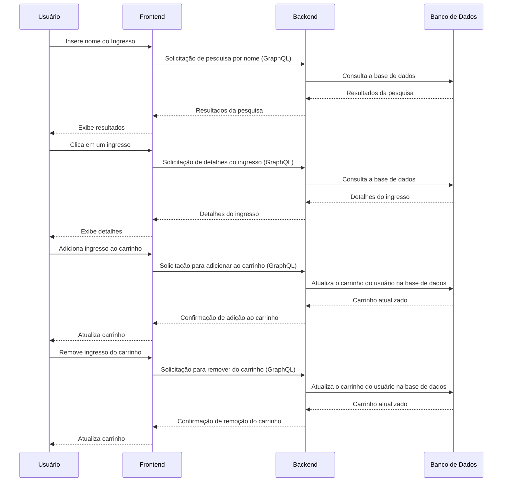

[//]: # ([![MIT License]&#40;https://img.shields.io/apm/l/atomic-design-ui.svg?&#41;]&#40;https://github.com/tterb/atomic-design-ui/blob/master/LICENSEs&#41;)
[](https://github.com/mpluiz/ticket-hub-server/actions/workflows/ci.yml)


# TICKET HUB

- [app](https://tickethub.mpluiz.com.br)
- [server https://ticket-hub-server.onrender.com](https://ticket-hub-server.onrender.com)

## Requirements
- Node `<lts-version>`

## Environment Variables

Required*

`DATABASE_URL`*

`GRAPHQL_PORT`

## Manual Installation

Instructions to install dependencies and start the dev server\
put required variables in the `env` file*

```bash
cd <your-project-name>
npm i
cp .env-example .env
npx prisma migrate dev
npm run build
npm run start
```

## Automatic Installation with Docker Compose
```bash
docker-compose up -d
http://localhost:4040
```

## Tests

Instructions to run tests

```bash
  npm run test
```

Commands for tests

```bash
  npm run test:watch
  npm run test:ci
```

Coverage Report

```bash
  npm run test:coverage
```

### Architecture

The architecture used in this project was the Clean Architecture, using the concepts proposed by Robert Martin.


```
src/
  application/
    protocols/
    usecases/
  domain/
    entities/
  infra/
    database/
  main/
    adapters/
    factories/
    config/
    graphql/
  utils/
tests/
    factories/
    services/
prisma/
  migrations/
  schema
```

## Documentation

### Fluxo de Pesquisa por Nome:

1. O usuário insere o nome de um ingresso na barra de busca na interface do usuário do frontend.

2. Quando o usuário pressiona "Enter" ou aciona a busca, o frontend envia uma solicitação GraphQL ao backend, incluindo o nome do ingresso como parâmetro.

3. O backend processa a solicitação e retorna uma lista de ingressos disponíveis.

4. O frontend exibe os resultados da pesquisa ao usuário, incluindo informações como nome do evento, data, preço, etc.

5. O usuário pode navegar pelas páginas de resultados se a pesquisa retornar mais ingressos do que os que cabem em uma única página.

### Fluxo de Paginação de Resultados:

1. O frontend exibe uma interface de paginação para o usuário, no inferior da lista de resultados.

2. O usuário pode clicar em números de página ou nas setas de navegação para avançar ou retroceder nas páginas de resultados.

3. Quando o usuário interage com os controles de paginação, o frontend envia uma solicitação GraphQL ao backend, especificando a página desejada.

4. O backend processa a solicitação e retorna os resultados da página solicitada.

5. O frontend atualiza a lista de resultados exibida ao usuário com os novos dados da página selecionada.

### Fluxo de Visualização de Detalhes do Ingresso:

1. O usuário clica em um ingresso específico na lista de resultados da pesquisa ou em qualquer outra parte da interface que permita a visualização de detalhes.

2. O frontend envia uma solicitação GraphQL ao backend, incluindo o ID do ingresso que o usuário deseja visualizar.

3. O backend recupera os detalhes do ingresso com base no ID fornecido e retorna essas informações para o frontend.

4. O frontend exibe os detalhes do ingresso, incluindo nome do evento, data, preço, localização e outras informações relevantes.

### Fluxo de Adição e Remoção de Ingressos no Carrinho:

1. Quando o usuário decide adicionar um ingresso ao carrinho, o frontend envia uma solicitação GraphQL ao backend, incluindo o ID do ingresso a ser adicionado.

2. O backend processa a solicitação e adiciona o ingresso ao carrinho associado ao usuário.

3. O frontend atualiza a visualização do carrinho para refletir o ingresso adicionado, mostrando detalhes como nome do evento, quantidade, preço, etc.

4. O usuário pode continuar navegando e adicionando mais ingressos ao carrinho ou remover ingressos do carrinho conforme desejado.

5. Quando o usuário decide finalizar a compra, o frontend envia uma solicitação GraphQL ao backend para concluir a compra, incluindo informações sobre os itens no carrinho.

6. O backend processa a solicitação, registra a compra e remove os ingressos do carrinho do usuário.

7. O backend pode gerar um recibo de compra e enviá-lo ao frontend para exibição ao usuário.

### Diagram



## Documentation reference
- [Node](https://nodejs.org/api/)
- [Typescript](https://www.typescriptlang.org/docs/)
- [Apollo Graphql](https://www.apollographql.com/docs/)
- [Prisma ORM](https://www.prisma.io/docs)
- [Vitest](https://vitest.dev/guide/)

## How to contribute

- Make a fork of this repository;
- Create a branch with your feature: `git checkout -b <your-branch>`;
- Make a commit : `git commit -m '<commit-message>'`;
- Push to your branch: `git push <origin> your-branch`;

## License

[MIT](https://choosealicense.com/licenses/mit/)
