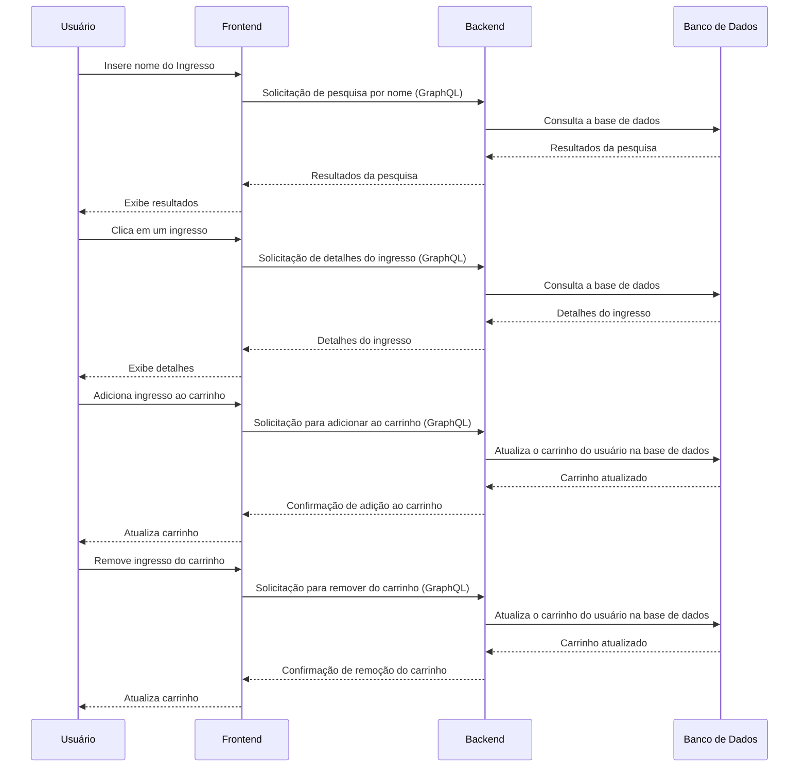

```mermaid 
sequenceDiagram

participant User as Usuário
participant Frontend as Frontend
participant Backend as Backend
participant Database as Banco de Dados

User ->> Frontend: Insere nome do Ingresso
Frontend ->> Backend: Solicitação de pesquisa por nome (GraphQL)
Backend ->> Database: Consulta a base de dados
Database -->> Backend: Resultados da pesquisa
Backend -->> Frontend: Resultados da pesquisa
Frontend -->> User: Exibe resultados

User ->> Frontend: Clica em um ingresso
Frontend ->> Backend: Solicitação de detalhes do ingresso (GraphQL)
Backend ->> Database: Consulta a base de dados
Database -->> Backend: Detalhes do ingresso
Backend -->> Frontend: Detalhes do ingresso
Frontend -->> User: Exibe detalhes

User ->> Frontend: Adiciona ingresso ao carrinho
Frontend ->> Backend: Solicitação para adicionar ao carrinho (GraphQL)
Backend ->> Database: Atualiza o carrinho do usuário na base de dados
Database -->> Backend: Carrinho atualizado
Backend -->> Frontend: Confirmação de adição ao carrinho
Frontend -->> User: Atualiza carrinho

User ->> Frontend: Remove ingresso do carrinho
Frontend ->> Backend: Solicitação para remover do carrinho (GraphQL)
Backend ->> Database: Atualiza o carrinho do usuário na base de dados
Database -->> Backend: Carrinho atualizado
Backend -->> Frontend: Confirmação de remoção do carrinho
Frontend -->> User: Atualiza carrinho
```
